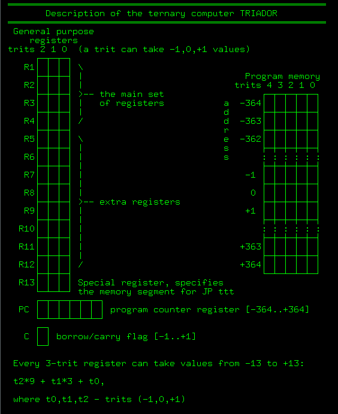
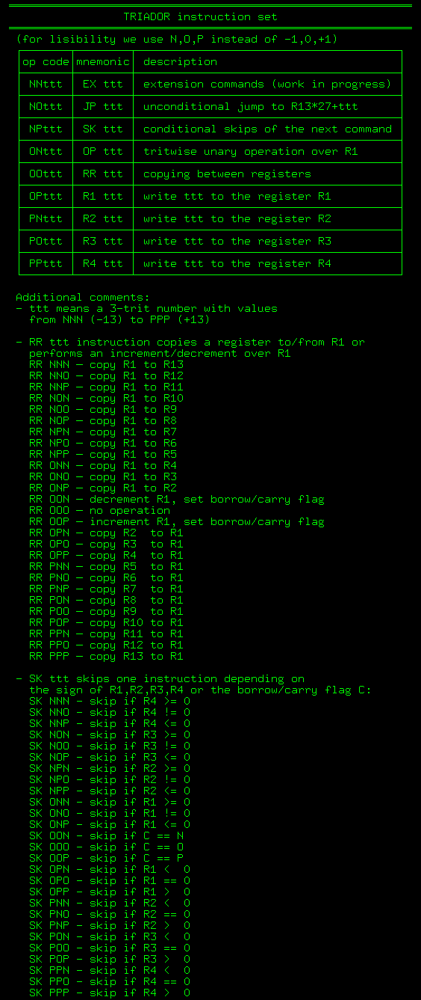

# The ultimate goal: a ternary computer

Many claimed to build a ternary computer, however nobody (to the best of my knowledge) completed the project. Triador project makes no empty promises!

I am building a very simple but functional 3-trit balanced ternary computer. The only building block allowed is a ternary multiplexer based on DG403 analog switches. You can find more details on the build at the [homebrew ternary computer](https://hackaday.io/project/28579-homebrew-ternary-computer) hackaday project. Also check this youtube mini-series about the hardware:

[](https://www.youtube.com/playlist?list=PL9MBW6e0V7UIvP2vY_aKwsu93wqYq5jXJ)

# Architecture description
This repository contains a program emulator that eases the debugging of the hardware. Triador has a 3-trit architecture, this means that its registers can store numbers from -13 to +13. It has four main registers R1-R4 and nine extra registers R5-R13. Note that R13 is a special register used to choose current program memory segment (more on this below). So, in total, Triador can store 13 numbers from the [-13..+13] range. In addition to that, it has a 1-trit borrow/carry flag and a 6-trit program counter register. The read-only program memory has 27 segments, 27 instructions per segment. So, max program size is 729 instructions. Here is a graphic description:



# Instruction set
Triador has a very limited instruction set, it is very close to [Brainfuck](https://en.wikipedia.org/wiki/Brainfuck) in terms of expressivity, but offers a much more readable code (check for the examples below).

Triador understands 9 instructions; each instruction has a mandatory 3-trit argument. Note that the extension instruction at the moment is interpreted as [halt and catch fire](https://en.wikipedia.org/wiki/Halt_and_Catch_Fire_(computing)). Here is the complete list of available instructions:



# Interpreter compilation
```sh
git clone https://github.com/ssloy/triador.git
cd triador
mkdir build
cd build
cmake ..
make
./triador ../prog/add.txt
```

You can open the project in Gitpod, a free online dev evironment for GitHub:

[](https://gitpod.io/#https://github.com/ssloy/triador)

On open, the editor will compile & run the program. Just change the code in the editor and rerun the script (use the terminal's history).

# Program file specifications
The program file must contain a single instruction per line. The instruction must be in the first 6 characters of each line, any character beyond the first 6 is discarded. Therefore, each line must contain one of the following instructions,
where ttt means a 3-trit number with values from NNN (-13) to PPP (+13):
* EX ttt
* JP ttt
* SK ttt
* OP ttt
* RR ttt
* R1 ttt
* R2 ttt
* R3 ttt
* R4 ttt

The emulator prints the complete state of the Triador computer for every instruction computational step.

# Example programs
Note that Triador has no input interface. To enter your data into the computer, use R1-R4 commands.

## add
I want to sum two numbers written in registers R2 and R3. But the Triador knows nothing about addition! It only knows how to do increment/decrement. Let's start by writing a simple program in an environment you master. For a start, I assume that R2 and R3 are non-negative. We can decrement R2 and increment R3 simultaneously until R2 reaches zero:

```cpp
int main() {
    unsigned int R2 = 2;
    unsigned int R3 = 11;
    while (R2!=0) {
        R3++;
        R2--;
    }
    return R3;
}
```

Okay, what about signed numbers? No problem, we can adapt our code a bit in a way that the absolute value of R2 decreases with each iteration:

```cpp
int main() {
    int R2 = -2;
    int R3 = 13;
    while (R2!=0) {
        if (R2>0) R3++;
        if (R2<0) R3--;
        if (R2>0) R2--;
        if (R2<0) R2++;
    }
    return R3;
}
```

That is all! Here is [a very simple program](prog/add.txt) that writes two numbers to the registers R2 and R3 and computes their sum. The result is stored in R3:


The first column (6 first characters of each line) is the actual program. The program counter (PC) is initialized to NNN NNN. Recall that any character beyond the first 6 is considered to be a comment.

Here is an execution log:
```
$ ./triador ../prog/add.txt | tail -n 3
 R1  R2  R3  R4  R5  R6  R7  R8  R9 R10 R11 R12 R13  C   PC
 11   0  11   5   0   6 -12  -2  11   8  11 -10 -13  0  -345
```
Note that R3 contains 11, the result of -2 + 13.

## add with overflow control
This program writes two numbers to the registers R2 and R3, and computes their sum. The result is stored as R3 + R4 * 27, that is, R4 can be -1, 0 or 1 and represents an eventual overflow of R2+R3.


```
$ ./triador ../prog/add-with-overflow-control.txt |tail -n 3
 R1  R2  R3  R4  R5  R6  R7  R8  R9 R10 R11 R12 R13  C   PC
-12   0 -12   1  -9   2 -12  -6   4   5   6   7 -13  0  -338
```
Note that R3 + 27 * R4 is equal to 15, the result of 2+13 operation.

## 6-trit addition
Are [-13..+13] registers not expressive enough? No problems, let us introduce a word data type.
[This program](https://github.com/ssloy/triador/blob/master/prog/long-add.txt) writes a 6-trit number to R1,R2 and a second 6-trit number to R3,R4. Then a 6-trit sum is computed and stored in R4,R5.


```
$ ./triador ../prog/long-add.txt |tail -n 3
 R1  R2  R3  R4  R5  R6  R7  R8  R9 R10 R11 R12 R13  C   PC
  3   0   0  -6   3 -13   1   3   6   5  13  -2 -13  0  -335
```
Note that R4+27 * R5 = 75, and we asked for the computer to compute 331-256.

## Greatest common divisor
Of course, our example set would not be complete without [Euclid's algorithm](https://en.wikipedia.org/wiki/Euclidean_algorithm). [This program](https://github.com/ssloy/triador/blob/master/prog/gcd.txt) computes the greatest common divisor between R2 and R3,
the result is stored back in R2.


```
$ ./triador ../prog/gcd.txt |tail -n 3
 R1  R2  R3  R4  R5  R6  R7  R8  R9 R10 R11 R12 R13  C   PC
-13   4  -4   0   4  12  13   1  -7  -9   3   4 -13  0  -338
```
Note that R2 is equal to 4, the greatest common divisor of 12 and -8.
